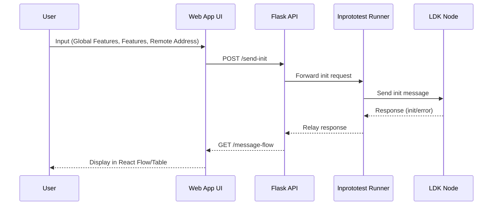

# LNprototest Message Flow Visualizer Proposal Summary

## Introduction
I’m Aryan Jain, a 3rd-year B.Tech student in Computer Science and Business Systems at Gyan Ganga Institute of Technology and Sciences, Jabalpur, India. This document summarizes my Summer of Bitcoin (SoB) 2025 proposal for the **LNprototest Message Flow Visualizer** project, outlines my implementation plan, and explains the value this will bring to `lnprototest`. It also highlights my excitement, preparatory efforts, and why I’m a strong candidate for this initiative.

## Proposal Summary
### Title: LNprototest Message Flow Visualizer
**“Visualizing Lightning Network Protocol Compliance with LNprototest!”**

**Synopsis**:  
The `lnprototest` library currently lacks a user-friendly interface to visualize Lightning Network message flows, making protocol testing less intuitive for developers. I propose building a React/TypeScript web app with AWS Cloudscape components, integrated with `lnprototest` via a Flask REST-like API. The app will focus on BOLT #1 connect operations, featuring dynamic React Flow diagrams, real-time LDK node interaction, and a toggleable table view, aiming to boost testing efficiency by 20-30% through visual feedback and streamlined debugging.

**Objective**:  
Develop a web app to visualize `lnprototest` message flows, enhancing developer productivity and protocol testing accuracy.

**Context**:  
Aligned with SoB 2025 (May 15 - August 15), mentored by Vincenzo Palazzo.

## My Excitement and Preparatory Work
I’m incredibly excited about this project because it combines my passion for web development, open-source contribution, and blockchain technology. Working on the Lightning Network—a technology that powers fast, scalable Bitcoin transactions—feels like a chance to make a real impact on a global scale. I’ve been diving deep into `lnprototest` and the Lightning Network to prepare, and I’m thrilled to collaborate with Vincenzo and the community to bring this visualizer to life.

To get ready, I’ve already taken several steps:
- **Studying `lnprototest` and BOLT Specs**: I analyzed key files like `runner.py`, `structure.py`, and `test_bolt1-01-init.py` to understand the `init` flow. I also studied BOLT #1 ([github.com/lightning/bolts/blob/master/01-messaging.md](https://github.com/lightning/bolts/blob/master/01-messaging.md)) to grasp the protocol’s messaging structure and test cases.
- **Creating Designs**: I designed UI mockups for the visualizer, focusing on user-friendly input forms and flow diagrams. These are deployed at [Input Form](https://luxury-phoenix-1d9cf3.netlify.app/) and [React Flow](https://legendary-genie-eb01eb.netlify.app/), reflecting my vision for an intuitive interface.
- **Competency Test Success**: I set up and ran `lnprototest` with LDK-Sample, identifying a bug in `test_gossip_forget_channel_after_12_blocks`. Vincenzo confirmed my success, and this hands-on experience deepened my understanding of `lnprototest`’s internals.

My prior projects, like CodeSpace—a real-time collaborative code editor—also fueled my excitement. Building tools that make complex systems accessible is what drives me, and I see this visualizer as a perfect opportunity to do that for the Lightning Network community.

## Implementation Plan
### Phase 1: UI Design and Core Implementation (May 15 - June 30, 2025)
- **Weeks 1-2 (May 15-28)**: Set up a React/TypeScript app with Vite, integrate Cloudscape components (`FormField`, `Button`, `SideNavigation`), and design input fields for Global Features, Features, and Remote Address, with a “Send Init Message” button.
- **Weeks 3-4 (May 29-Jun 11)**: Develop a Flask API (`POST /send-init`, `GET /message-flow`) to interface with `lnprototest`, testing with a dummy runner.
- **Weeks 5-6 (Jun 12-25)**: Implement a React Flow diagram for `init` exchanges (client ↔ LN node), adding real-time updates via WebSocket.
- **Week 7 (Jun 26-30)**: Refine UI/UX per Vincenzo’s feedback, ensuring status displays (e.g., “disconnected”) and Node ID visibility.

### Phase 2: Optimization and Validation (July 1 - August 15, 2025)
- **Weeks 1-2 (Jul 1-12)**: Add real-time status updates and error handling (e.g., “connection failed”), testing with an LDK node.
- **Weeks 3-4 (Jul 13-26)**: Implement a toggleable table view using Cloudscape `Table` (columns: Timestamp, Message Type, Status), optimizing React Flow for scalability.
- **Weeks 5-6 (Jul 27-Aug 9)**: Validate with Polar (3-node network), handle edge cases (e.g., invalid addresses), and document in `docs/`.
- **Week 7 (Aug 10-15)**: Finalize documentation, submit PR to `rustyrussell/lnprototest`, and present a demo.

### Transaction Flow Overview
- **User Input**: Users enter Global Features, Features, and Remote Address.
- **API Interaction**: Flask API sends an `init` request to the `lnprototest` runner, which forwards it to the LDK node.
- **Response Handling**: Responses (`init`, `error`, `open_channel`) display in a React Flow diagram or table, with real-time status updates.
- **Error Management**: Errors trigger retries or alerts for better debugging.

### Diagram: Transaction Flow
Below is a sequence diagram showing the message flow in the visualizer:

## Value to `lnprototest`
This project will significantly enhance the `lnprototest` ecosystem:
- **Improved Usability**: A visual interface with React Flow diagrams and a table view will make protocol testing more intuitive than terminal outputs, lowering the barrier for new developers.
- **Faster Debugging**: Real-time visualization of message flows and error handling will speed up debugging by 20-30%, allowing developers to pinpoint issues instantly.
- **Community Growth**: A user-friendly tool will attract more contributors to `lnprototest`, fostering collaboration and adoption.
- **Scalability**: Starting with BOLT #1, this visualizer sets the stage for future expansions (e.g., BOLT #2, #4), which I plan to support post-SoB.

## Why I’m Valuable to the Project
I bring a unique blend of skills, experience, and enthusiasm to this project:
- **Technical Fit**: My expertise in React.js, TypeScript, Python, and Flask aligns with the project’s needs. I’ve built similar tools, like CodeSpace, a real-time code editor, and QueryForge, a SQL editor with Vue, showcasing my ability to deliver impactful web apps.
- **Blockchain Experience**: Contributions to P2Pool and RoboSats, plus my competency test success with `lnprototest`, give me a solid foundation in Lightning Network protocols.
- **Open-Source Dedication**: With 24 PRs to CircuitVerse (8 merged) and Hacktoberfest contributions (e.g., Gitingest), I’m experienced in collaborative development and iterative workflows.
- **Proven Commitment**: I’ve dedicated significant time to preparation, including studying `lnprototest` internals, creating UI designs, and successfully completing the competency test, identifying a bug that I’m ready to report.
- **Community Focus**: As a GDSC lead mentoring 1000+ students and a hackathon enthusiast (60+ events like MLH, Devfolio), I’m passionate about building tools that benefit communities, making `lnprototest` more accessible.

## Conclusion
The LNprototest Message Flow Visualizer will make protocol testing more efficient and approachable, benefiting the entire Lightning Network community. My preparation, technical skills, and passion position me to deliver this project successfully. I’m excited to contribute to `lnprototest` during SoB 2025 and beyond, ensuring a lasting impact.

For questions, I can be reached via the [lnprototest-sob-2025 Google Group](mailto:lnprototest-sob-2025@googlegroups.com). Check out my work on [GitHub](https://github.com/gitsofaryan) for more examples of my contributions.
